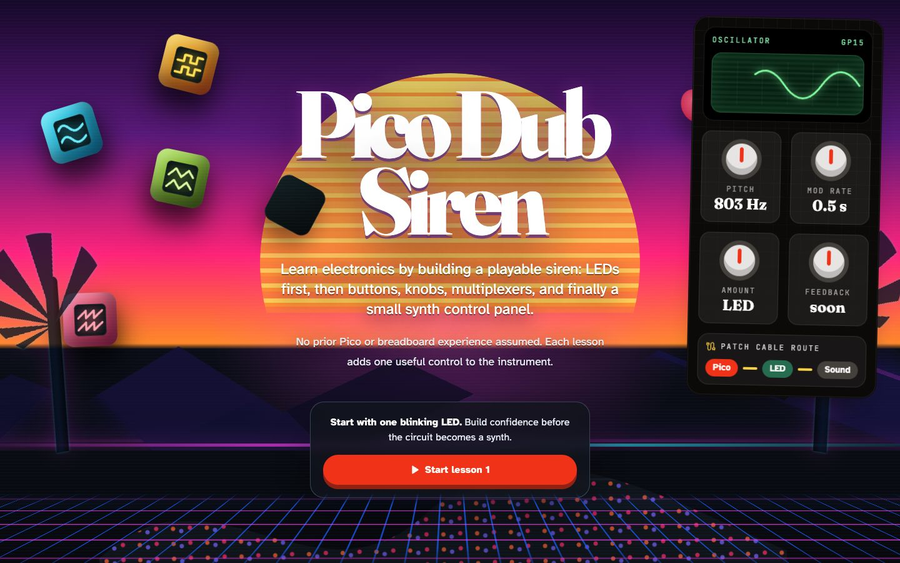

# Pico Dub Siren Course

A beginner-friendly Raspberry Pi Pico 2 course: learn electronics and MicroPython one small circuit at a time, then combine the controls into a playable synthesiser.

This is a Pico learning project, not a component-for-component recreation of the analogue 555 dub siren. It is inspired by [Lonesoulsurfer's Dub Siren V3](https://www.instructables.com/Dub-Siren-V3-555-Project/) and carries its hands-on, playable spirit into a low-cost digital build.

## Open the course

**[Launch the Pico Dub Siren course](https://abeldebruijn.github.io/dub-siren-v3-555-project/)**

[](https://abeldebruijn.github.io/dub-siren-v3-555-project/)

## What you will build

The course starts with one external LED and assumes no Pico, breadboard, or programming experience. Each lesson adds one useful idea or physical control:

- safe 3.3 V breadboard wiring;
- LEDs, buttons, and potentiometers;
- non-blocking MicroPython programs;
- several controls through a CD74HC4051 multiplexer;
- a five-position modulation selector;
- first audio tones and a continuous oscillator;
- a complete control surface for a small dub-siren synthesiser.

The first instrument stage uses the Pico as a USB-MIDI controller connected to a Mac software synth. Standalone sound with a PCM5102A I²S DAC is a later expansion. GP10–GP12 remain reserved for it.

## The 20 included lessons

### Pico controls

1. [Blink an external LED](lessons/0001-blink-an-external-led.html)
2. [Let a button control the LED](lessons/0002-button-controls-led.html)
3. [Toggle the LED with one press](lessons/0003-toggle-with-one-press.html)
4. [Read a potentiometer](lessons/0004-read-a-potentiometer.html)
5. [Control LED brightness with a potentiometer](lessons/0005-pot-controls-led.html)
6. [Control flash rate with a potentiometer](lessons/0006-pot-controls-flash-rate.html)
7. [Control rate and amount with two potentiometers](lessons/0007-two-pots-rate-and-amount.html)
8. [Add the pitch potentiometer](lessons/0008-add-pitch-pot.html)
9. [Read the first CD74HC4051 channel](lessons/0009-first-4051-channel.html)
10. [Select two CD74HC4051 channels](lessons/0010-two-4051-channels.html)
11. [Keep multiplexer reading responsive](lessons/0011-scheduled-mux-reading.html)
12. [Select three multiplexer channels](lessons/0012-three-mux-channels.html)
13. [Add the feedback control on channel 3](lessons/0013-add-feedback-on-ch3.html)
14. [Add the tempo control on channel 4](lessons/0014-add-tempo-on-ch4.html)
15. [Read the modulation-type selector](lessons/0015-read-mod-type-selector.html)

### Audio and synthesis

16. [Generate the first tones](rca-module-13-2/lessons/0001-first-tones.html)
17. [Build a continuous prepared-tone oscillator](rca-module-13-2/lessons/0002-continuous-oscillator.html)

### Hardware references

18. [Wire a Pico for the first time](reference/pico-first-wiring.html)
19. [Read resistor colour codes](reference/resistor-colour-codes.html)
20. [Understand four-leg tactile-button wiring](reference/tactile-button-wiring.html)

Extra: [Bit operations appendix](lessons/apx1-bit-opperations.html).

## Course approach

- Raspberry Pi Pico 2 with headers
- MicroPython and `picozero` for the beginner lessons
- solder-free breadboard prototypes first
- one visible, testable result per lesson
- practical troubleshooting before added software complexity
- reusable example programs in [`examples/`](examples/)

The longer-term goal is a cost-effective instrument with pitch, modulation, tempo, feedback, mode selection, triggering, and audio output—not an isolated collection of electronics exercises.

## Repository map

| Path | Contents |
|---|---|
| [`site/`](site/) | React course interface deployed to GitHub Pages |
| [`lessons/`](lessons/) | Pico control lessons in standalone HTML |
| [`examples/`](examples/) | MicroPython program for each numbered Pico lesson |
| [`rca-module-13-2/`](rca-module-13-2/) | Separate audio-output and oscillator experiments |
| [`reference/`](reference/) | Beginner wiring and component references |
| [`learning-records/`](learning-records/) | Tested observations and teaching notes |
| [`shopping-raspberry.md`](shopping-raspberry.md) | Pico-focused parts and purchasing notes |
| [`MISSION.md`](MISSION.md) | Project scope, constraints, and definition of success |

## Run the course locally

```sh
cd site
pnpm install
pnpm dev
```

The React migration is in progress. Lesson 1 is available in the new course interface; the complete numbered lesson set remains available in `lessons/`.

## Safety

Use only 3.3 V on Pico GPIO pins. Disconnect power before changing wiring, verify polarity before reconnecting, and begin audio tests at low volume. Do not connect a speaker-level output directly to a mixer or other line-level input.

## Inspiration and credit

The original [Dub Siren V3 — 555 Project](https://www.instructables.com/Dub-Siren-V3-555-Project/) is an analogue instrument built around 555 timers. This independent course borrows its musical inspiration while teaching a different Pico-based implementation.
